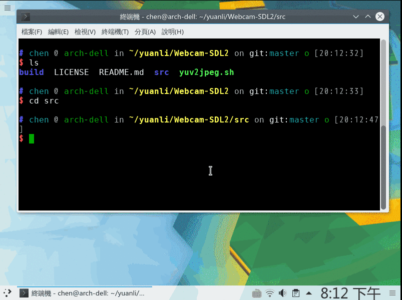

# Webcam-SDL2

[](https://travis-ci.org/chendotjs/Webcam-SDL2)

## Intro

This is a simple example which illustrates how to capture video(or image if you like) using `v4l2` and to display with [SDL2](https://www.libsdl.org/).

Currently, most webcams supports `YUYV422` output format. So the default output format is set to `YUYV422`. You can modify the format parameter both for `v2lc` and `sdl2` to be compatible with your webcam.

To list support formats of your webcam, try following commands:
```bash
v4l2-ctl --list-formats-ext
```
or if `ffmpeg` installed
```bash
ffmpeg -f v4l2 -list_formats all -i /dev/video0
```

## Usage

Both `Makefile` and `CMakeLists` are provided.

-   using `Makefile`
```bash
git clone https://github.com/chendotjs/Webcam-SDL2
cd Webcam-SDL2/src
sudo apt-get install libsdl2-dev
make
./simple_cam 640 480 /dev/video0
```

-   using `CMakeLists`
```bash
git clone https://github.com/chendotjs/Webcam-SDL2
cd Webcam-SDL2/
sudo apt-get install libsdl2-dev
mkdir build && cd build
cmake ../src
make
./simple_cam 640 480 /dev/video0
```


## References

[fswebcam](https://github.com/fsphil/fswebcam)

[CAPTURING A WEBCAM STREAM USING V4L2](https://jwhsmith.net/2014/12/capturing-a-webcam-stream-using-v4l2/)

[最简单的视音频播放示例1：总述](http://blog.csdn.net/leixiaohua1020/article/details/40246783)
